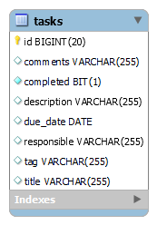

# Sistema de gestion de tareas

En el siguiente proyecto se podra encontrar una API REST Para el registro de tareas. El sistema permite a los usuarios visualizar, agregar, editar y eliminar tareas.

Cada tarea tiene un título, descripción, estado de completitud, fecha de entrega, comentarios, responsable y etiquetas.

En este caso se usa Java con el framework web de Spring boot para la creacion de dicha API REST.


## Dependencias

Asegúrate de tener instaladas las siguientes dependencias antes de ejecutar la API:

- spring-boot-starter-data-jdbc
- spring-boot-starter-web
- mysql-connector-java : 8.0.27
- spring-boot-starter-data-jpa
- lombok : 1.18.24

## Requisitos

A continuacion se especifican ciertas tecnologias que necesitas tener instaladas para poder utilizar la API:

- maven 3.9.1
- JDK 17
- IDE de tu preferencia
- Postman o la herramienta de desarrollo de APIs y cliente HTTP de tu agrado
- XAMPP, MAMP o WAMP
## Guia de instalación

Sigue estos pasos para descargar y ejecutar la API REST:

- Clona el repositorio: 
Abre una terminal o línea de comandos y ejecuta el siguiente comando para clonar el repositorio:

```git clone https://github.com/FerchoKD/Sistema-de-gestion-de-tareas.git```

- Accede al directorio del proyecto: 

En la terminal, navega al directorio del proyecto clonado:

```cd Sistema-de-gestion-de-tareas```

- Compila y construye el proyecto: 

Ejecuta el siguiente comando para compilar y construir el proyecto:

```./mvnw clean package```

-Ejecuta el proyecto: 

Ejecuta el siguiente comando para iniciar la aplicación Spring Boot:

```./mvnw spring-boot:run```

Y listo has ejecutado la API REST 

Nota: asegurate de haver ingresado tus credenciales en el archivo "___applications.properties___" 
y de tener activo los servicios de mysql y apache en tu paquete de servidor de aplicaciones (XAMPP, MAMP o WAMP)
## EndPoints

A continuación se describen los endpoints disponibles en la API:

Obtiene la lista de todas las tareas.

```GET /task/list```

Obtiene toda la información de una tarea específica.

```GET /task/list/{id}```

Crea una nueva tarea.

```POST /task/create ```

Edita una tarea existente.

```PUT /task/update/{id}```

Borra una tarea.

```DELETE /task/delete/{id}```

tambien puedes descargar la coleccion de endpoints 
[Aqui](Additional_Files/)
## Diagrama ER

A continuacion se proporciona una vista previa de la tabla correspondiente a tareas:


